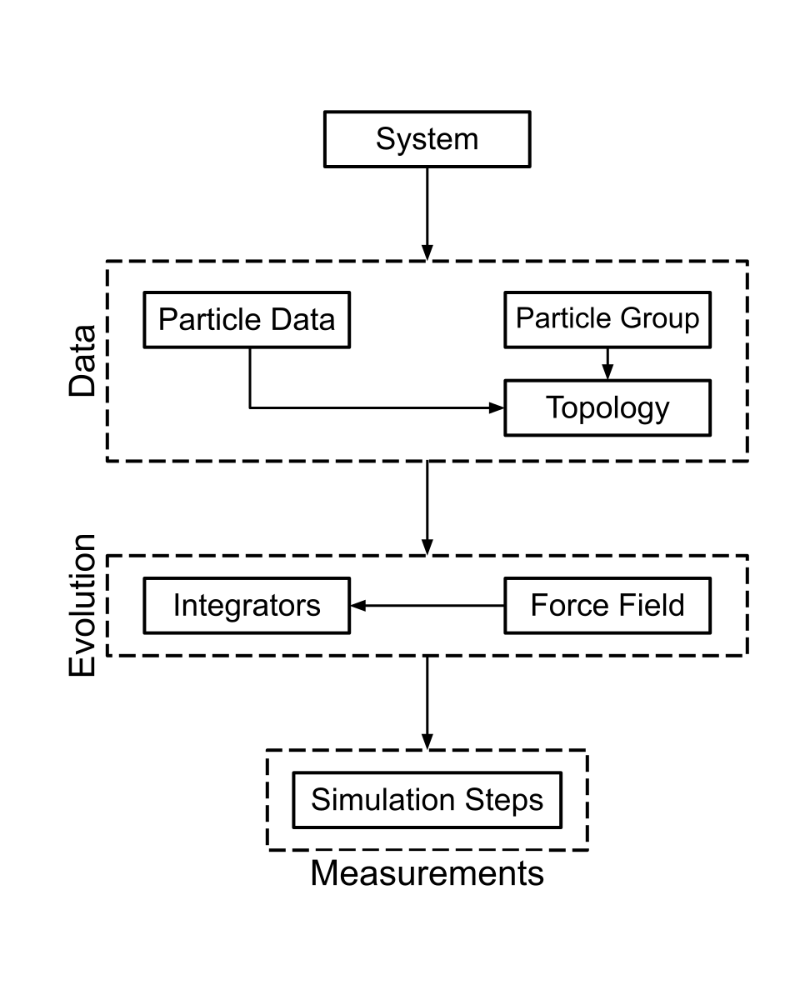

Workflow
========

Various entities store and manage the necessary information to conduct a simulation in UAMMD-structured.
Each entity takes charge of a unique component of the simulation, such as
particle data, interactions in play, and the integrators used.

These entities don't operate in isolation. At times, one entity requires
information from another to function accurately. For instance, calculating
the interaction between two particles would likely require their positions.
This interconnected nature dictates a logical sequence in initializing these entities.
We first set up the basic entity, which will then be used by a more complex entity
that relies on the values and utilities provided by the basic entity.

These entities form the core of UAMMD-structured.
Some extend certain UAMMD modules, while others are entirely new. Let's delve into 
a brief description of each to better understand their roles:

**System**
   The primary entity within UAMMD, responsible for overarching system management.

**GlobalData**
   Manages and stores shared information for all particles in the system, such
   as units, time step, simulation box, temperature, and more.

**ParticleData**
   Handles and stores unique information for each particle, detailing aspects
   like position, velocity, and force.

**Topology**
   The topology is an entity that stores the information regarding
   the structure of the system and the interactions between its particles.
   The structure defines supraparticles compounds e.g., molecules, chains, residues, etc.
   while the interactions define the forces between the particles, the so-called forcefield.

**Integrators**
   It handles the integrators used to evolve the system. UAMMD-structured
   can handle multiple integrators for the same simulation. Note that
   here, as in UAMMD, integrator refer to more general concept.
   An integrator updates the system state, not necessarily by integrating
   the equations of motion. For instance, a minimization algorithm, or a 
   Monte Carlo algorithm, are also integrators.

**ForceField**
   ForceField handles the interactions between particles. It processes the interactions
   and merges them into a single force that is then applied to the particles. It can also perform
   additional tasks over the interactions, such as adding a turn-on and turn-off time.

**SimulationSteps**
   Operates by performing actions using the entire simulation as input. Its functionalities
   range from calculating system properties like temperature or pressure to writing
   the simulation state to a file using different formats.

The initialization of these entities is done in the following order, 
as shown in the figure above:

#. System: The system is initialized first, as it is the core entity of UAMMD-structured.
   It takes as one of its arguments the input, which will be accessed by the other entities.

#. GlobalData and ParticleData: The state of the system is completely defined by the 
   information stored in these entities.

#. Topology: The information regarding the structure is loaded in ParticleData. Interactions
   are preprocessed and stored.

#. ForceField: The interactions are processed and merged into a single force.

#. Integrators: The integrators are initialized using the information in GlobalData and
   ParticleData. ParticleData and GlobalData must be initialized before the integrators since
   they are used to set up the integrators.

#. SimulationSteps: The simulation steps are initialized using all the information in the system.

It is important to note that basic entities can be accessed by more complex entities. For instance,
ForceField can access GlobalData and ParticleData through Topology.

Understanding the initialization order and the mutual dependency of these entities
is pivotal for harnessing the full potential of UAMMD-structured. As you navigate,
remember that each entity, while distinct, plays into a larger, cohesive framework
of the simulation.

Once all the entities are initialized, the simulation can be run. We iterate over
the different integrators, and for each one, we perform the following steps:

#. Read the number of steps to perform for the current integrator.

#. Add the force field to the current integrator.

#. Perform the integration loop. For each integration step:

   #. Perform the simulation steps.

   #. Perform the integration step (force field is used by the integrator when needed).

These two main processes, initialization and integration, are the core of UAMMD-structured.
Keeping inside this framework, the user can add new specific functionalities. For instance,
the user can add a new integrator, a new simulation step, or a new potential. The selection of 
one or another type of entity is done by the user in the input file reducing as much as possible
the need to modify the code. UAMMD-structured provides a set of tools to make this process easier. 

So far, we have shown the initialization process of the components and the execution of the simulation.
Users have the flexibility to adjust the simulation's behavior through input files.
Additionally, one can also add and modify simulation components, such as introducing new integrators or interactions.
Subsequent sections will provide a detailed guide on these aspects.

.. admonition:: And, for developers...

    In particular UAMMD-structured is written in C++/CUDA, so commonly these entities
    are implemented as classes.

    UAMMD-structured doesn't need recompilation every time a different entity type is used.
    Instead, it processes the input and chooses the particular entity type, such as the integrator, interaction, simulation steps, etc., 
    at runtime. This feature allows users to change the simulation parameters without recompiling the code.

    Essentially, the input gets analyzed, and the necessary components for the simulation are handpicked.
    These entities are initialized following the sequence discussed above.
    This entire procedure is executed by the `Simulation` class.

    The `Simulation` class first initializes the different entities, then it runs the simulation.
    Let's examine the code for the `Simulation` class, focusing primarily on the constructor.
    The constructor takes a smart pointer to the `System` class, and then it initializes the different entities.

    .. code-block:: cpp
    
       class Simulation{
    
           private:
    
               // Main components of the simulation are declared here
    
               std::shared_ptr<ExtendedSystem>      sys; // System entity
    
               std::shared_ptr<GlobalData>           gd; // GlobalData entity
               std::shared_ptr<ExtendedParticleData> pd; // ParticleData entity
    
               /////////////////////////////////////////
    
               std::shared_ptr<Topology>           topology;    // Topology entity
               std::shared_ptr<IntegratorManager>  integrators; // Integrators entity
    
               std::shared_ptr<ForceField> ff;                         // ForceField entity
               std::shared_ptr<SimulationStepManager> simulationSteps; // SimulationSteps entity
    
           public:
    
               Simulation(std::shared_ptr<ExtendedSystem> sys):sys(sys){
    
                   // The System is initialized outside the class,
                   // and passed as an argument to the constructor
    
                   gd = std::make_shared<GlobalData>(sys);           // Initialize GlobalData
                   pd = std::make_shared<ExtendedParticleData>(sys); // Initialize ParticleData
    
                   /////////////////////////////////////////

                   // Load the topology
                   topology = std::make_shared<Topology>(sys, gd, pd);

                   // Load the force field
                   ff = std::make_shared<ForceField>(topology);

                   // Load the integrators
                   // Note that the integrators are loaded after the topology and the force field
                   // this is because topology can set some particle properties that are needed
                   // by integrators initialization.
                   // For example, the particle mass and the particle radius.
                   integrators = std::make_shared<IntegratorManager>(sys, gd, pd);
    
                   /////////////////////////////////////////
    
                   // Load the simulation steps
                   // Use Integrators and ForceField to initialize the simulation steps
                   simulationSteps = std::make_shared<SimulationStepManager>(integrators,ff);
    
               }
    
               ...
    
       };
    
    Once the components are initialized, the simulation is ready to run.
    This is done by calling the `run` method of the `Simulation` class.
    This method will execute the main loop of the simulation, it will iterate over the different integrators.
    For each integrator, it will load all the force field, 
    and then it will integrate the system for the specified number of steps.
    
    Below is the code for the `run` method:
    
    .. code-block:: cpp
    
       class Simulation{
    
           private:
    
              ...
    
           public:
    
              ...
    
              int run(){
    
                 Timer tim; // Timer to measure the time taken by the simulation
                 tim.tic(); // Start the timer
    
                 std::map<std::string,
                          std::shared_ptr<SimulationStep::SimulationStepBase>> simSteps = simulationSteps->getSimulationSteps();
                 // Get the simulation steps are requested from the SimulationStepManager and stored in a map
    
                 System::log<System::MESSAGE>("[Simulation] Running simulation...");
    
                 for(auto& integratorInfo: integrators->getSortedIntegratorSteps()){
                     // Iterate through the integrators
    
                     // Get the integrator name and the number of steps for the integrator
                     std::string name  = integratorInfo.name;
                     ullint      steps = integratorInfo.steps;
    
                     System::log<System::MESSAGE>("[Simulation] Running integrator (%s) for %llu steps...", name.c_str(), steps);
    
                     // Get the integrator from the IntegratorManager
                     std::shared_ptr<Integrator> currentIntegrator = integrators->getIntegrator(name);
    
                     // Load the force field into the integrators
                     currentIntegrator->addInteractor(ff);
    
                     // Initialize the simulation steps
                     System::log<System::DEBUG>("[Simulation] Initializing simulation steps...");
                     for(auto sStep : simSteps){
                         sStep.second->tryInit();
                     }
    
                     // Iterate through the steps
                     for(ullint i = 0; i < steps; i++){
                         for(auto sStep : simSteps){
                             // At each step, apply the simulation steps
                             sStep.second->tryApplyStep();
                         }
                         // Move the integrator forward in time e.i. integrate
                         currentIntegrator->forwardTime();
                     }
                 }
    
                 // Stop the timer and get the total time taken by the simulation
                 auto totalTime = tim.toc();
    
                 // Print the mean time per step
                 System::log<System::MESSAGE>("[Simulation] Mean FPS: %f",
                                              real(gd->getFundamental()->getCurrentStep())/totalTime);
    
                 return 0; // Successful completion
    
            }

    So far, we have seen how the simulation is initialized and executed. Essentially, 
    only the `System` and `Simulation` classes are needed to run a simulation. In the next code,
    `System` class is initialized (taking the input file as an argument), 
    and then the `Simulation` class is used to run the simulation.
    This code is all that is needed to run a fully functional simulation.

    .. code-block:: cpp

        #include "UAMMDstructured.cuh"
        
        using namespace uammd::structured;
        
        int main(int argc, char *argv[]) {
        
            if (argc < 2) {
                uammd::System::log<uammd::System::CRITICAL>("No input file provided!");
                return EXIT_FAILURE;
            }
        
            std::string inputFilePath = argv[1];

            std::shared_ptr<ExtendedSystem> sys = std::make_shared<ExtendedSystem>(in);
            {
                std::shared_ptr<Simulation> sim = std::make_shared<Simulation>(sys);
                sim->run();
            }
            sys->finish();
        
            return EXIT_SUCCESS;
        }

   **Note**: here we have used a simplified version of the code.
   In the full version, other functionalities are added, such as those
   related to the backup and restart of the simulation.

    
